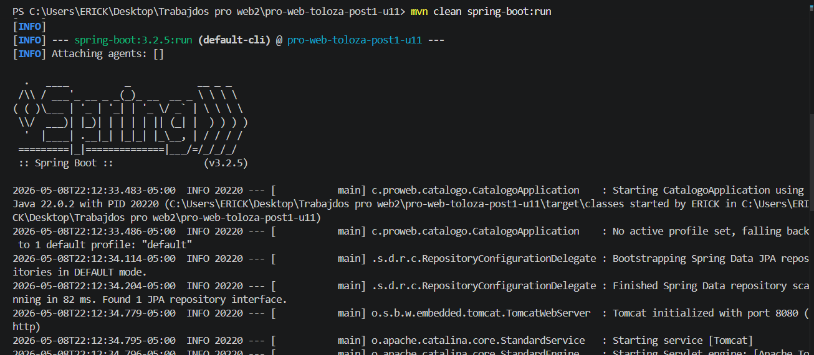
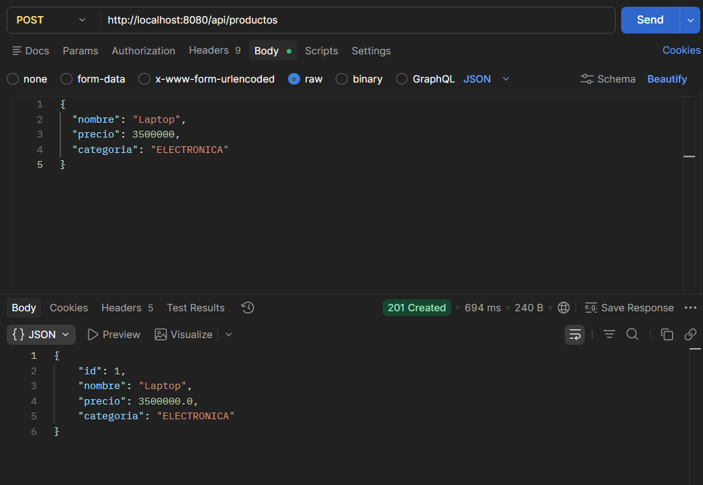
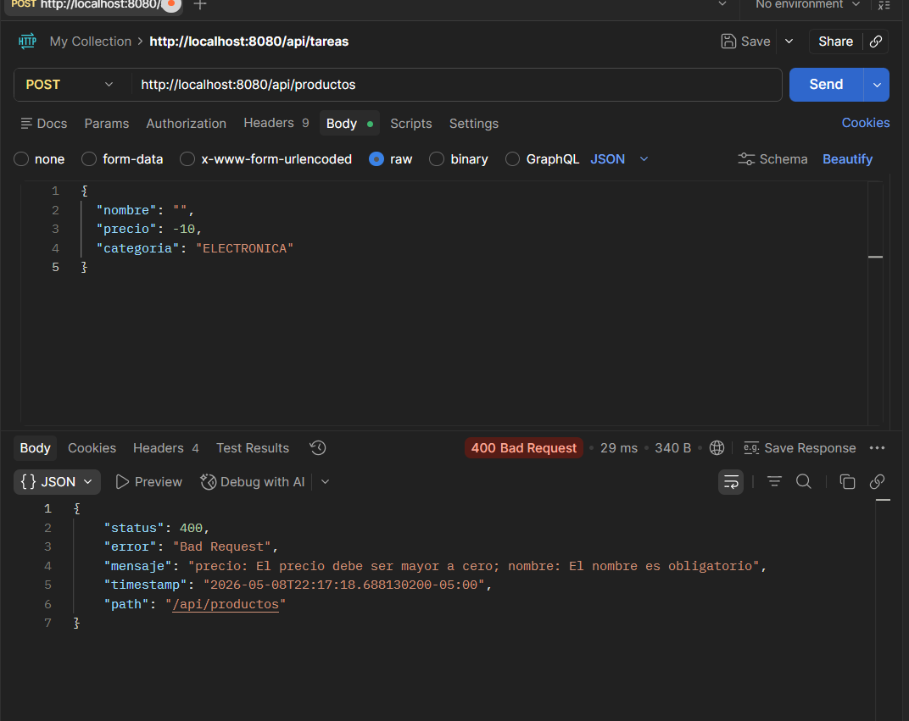
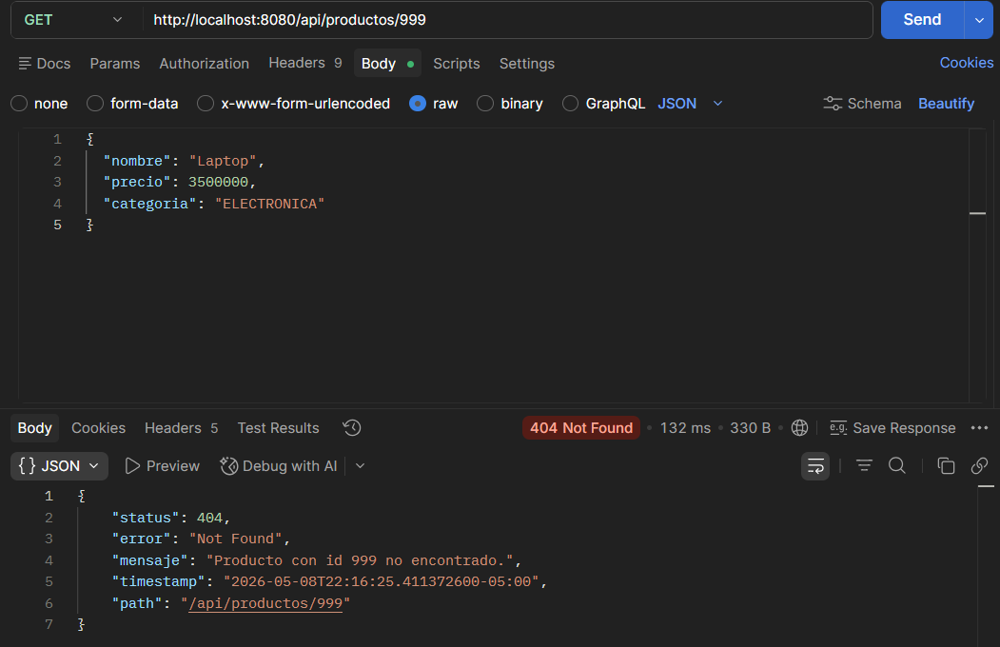

# U11 Post 1 - Refactorización con SOLID, DAO/DTO y @RestControllerAdvice

## Descripción
Refactorización de una aplicación Spring Boot aplicando los principios SOLID (SRP: Single Responsibility Principle, DIP: Dependency Inversion Principle), implementa los patrones DAO y DTO para separar capas, crea un Factory para la construcción de objetos de respuesta, y centraliza el manejo de excepciones mediante @RestControllerAdvice con respuestas de error estandarizadas.

## Requisitos
- Java 17+
- Spring Boot 3.2.x
- Maven 3.9.x
- Validación: spring-boot-starter-validation
- IDE: IntelliJ IDEA o VS Code con Extension Pack for Java

## Principios SOLID Aplicados

### S - Single Responsibility Principle
- **Controller**: Solo recibe HTTP y delega
- **Service**: Solo lógica de negocio
- **Repository**: Solo acceso a datos
- Cada clase tiene una única responsabilidad

### D - Dependency Inversion Principle
- Controller depende de abstracción ProductoService (interfaz)
- Service depende de ProductoRepository (abstracción)
- Inyección de dependencias en constructores

## Estructura del Proyecto
```
src/main/java/com/proweb/catalogo/
├── entity/
│   └── Producto.java               # Entidad JPA
├── repository/
│   └── ProductoRepository.java     # DAO (JpaRepository)
├── service/
│   ├── ProductoService.java        # Interfaz (abstracción)
│   └── ProductoServiceImpl.java     # Implementación
├── dto/
│   ├── ProductoRequestDTO.java     # Entrada (con validaciones)
│   └── ProductoResponseDTO.java    # Salida (sin datos sensibles)
├── factory/
│   └── ProductoFactory.java        # Conversión Entity <-> DTOs
├── exception/
│   ├── RecursoNoEncontradoException.java
│   ├── ApiError.java
│   └── GlobalExceptionHandler.java # @RestControllerAdvice
└── controller/
    └── ProductoController.java     # REST endpoints
```

## REST API Endpoints

### Crear Producto
```http
POST /api/productos
Content-Type: application/json

{
  "nombre": "Laptop",
  "precio": 3500000,
  "categoria": "ELECTRONICA"
}
```
**Respuesta (201 Created)**:
```json
{
  "id": 1,
  "nombre": "Laptop",
  "precio": 3500000,
  "categoria": "ELECTRONICA"
}
```

### Obtener Producto por ID
```http
GET /api/productos/{id}
```
**Respuesta (200 OK)** o **404 Not Found**

### Listar Productos Activos
```http
GET /api/productos
```
**Respuesta (200 OK)**: array de ProductoResponseDTO

### Eliminar Producto
```http
DELETE /api/productos/{id}
```
**Respuesta (204 No Content)** o **404 Not Found**

## Manejo de Excepciones con @RestControllerAdvice

Los errores retornan respuestas estandarizadas:

### 400 Bad Request (Validación)
```json
{
  "status": 400,
  "error": "Bad Request",
  "mensaje": "nombre: El nombre es obligatorio; precio: El precio debe ser mayor a cero",
  "path": "/api/productos"
}
```

### 404 Not Found
```json
{
  "status": 404,
  "error": "Not Found",
  "mensaje": "Producto con id 999 no encontrado.",
  "path": "/api/productos/999"
}
```

### 500 Internal Server Error
```json
{
  "status": 500,
  "error": "Internal Server Error",
  "mensaje": "Error inesperado en servidor",
  "path": "/api/productos"
}
```

## Ejecución

### Iniciar aplicación
```bash
mvn spring-boot:run
```
Disponible en: http://localhost:8080

### Compilar sin tests
```bash
mvn clean compile
```

### Ejecutar tests
```bash
mvn test
```

## Checkpoints Implementados

### ✓ Checkpoint 1: Entidad, DTOs y Factory
- Entidad Producto con @Entity y validaciones
- ProductoRequestDTO con @NotBlank, @Positive
- ProductoResponseDTO sin datos sensibles
- ProductoFactory centraliza conversiones

### ✓ Checkpoint 2: Service con DIP y Repository (DAO)
- ProductoService (interfaz) - Abstracción
- ProductoServiceImpl implementa DIP
- ProductoRepository extiende JpaRepository
- Excepción personalizada RecursoNoEncontradoException

### ✓ Checkpoint 3: GlobalExceptionHandler
- @RestControllerAdvice centraliza errores
- @ExceptionHandler para RecursoNoEncontradoException (404)
- @ExceptionHandler para MethodArgumentNotValidException (400)
- @ExceptionHandler para Exception genérica (500)

## Evidencias

### Aplicación Iniciada


### POST Exitoso (201 Created)


### Error Validación (400 Bad Request)


### Recurso No Encontrado (404 Not Found)


## Tecnologías
- **Spring Boot**: Framework web
- **Spring Data JPA**: Acceso a datos
- **H2 Database**: BD para desarrollo
- **Bean Validation**: Validación de datos
- **Lombok** (opcional): Reducir boilerplate

Autor

Diego Armando Cayetano
